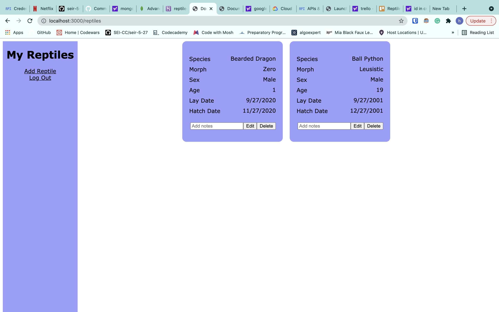
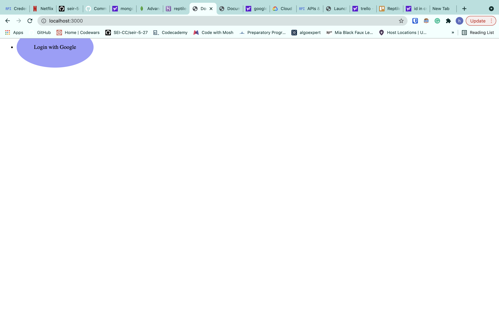
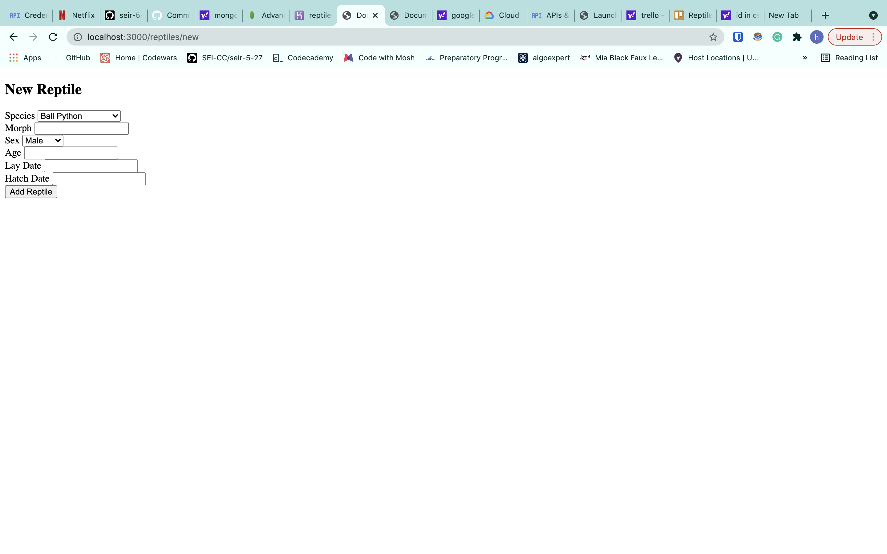
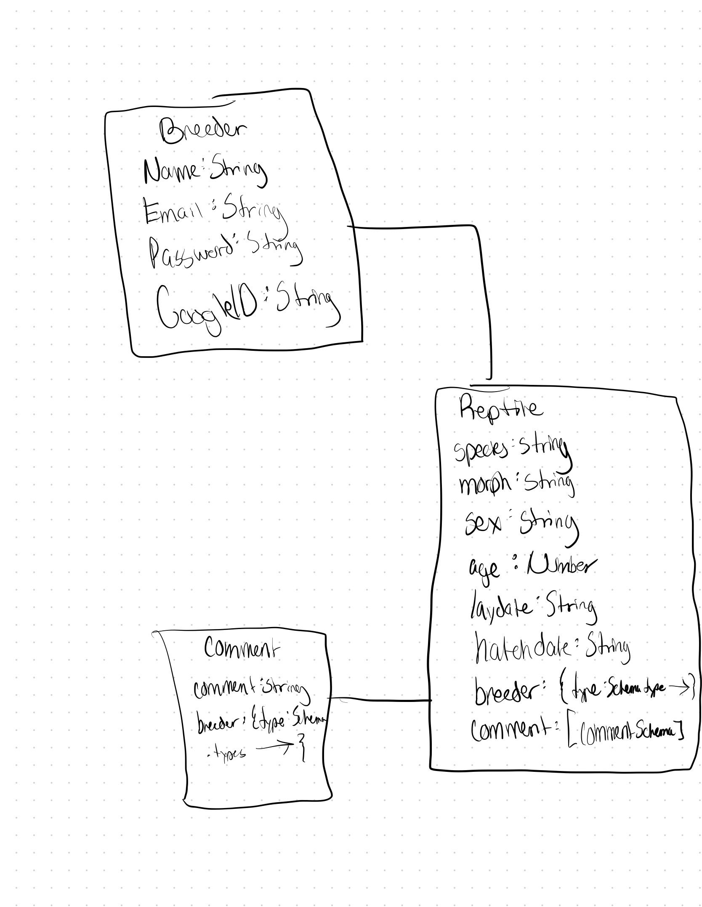
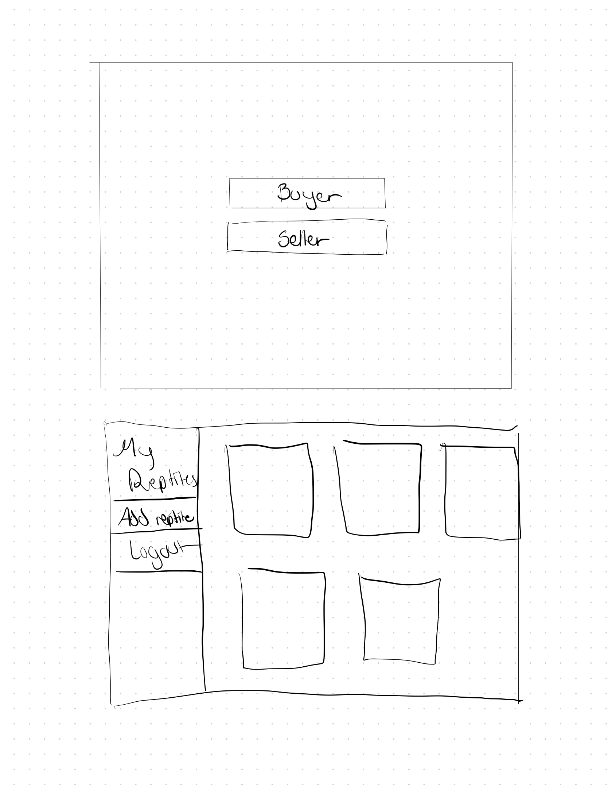

# Reptile Breeder Database

Most reptile breeders use pen and paper to keep track of their reptiles, the purpose of this app was to digitize their collection for easy access. 

Technologies Used
    HTML-CSS-Javascript-Node.js-Express-MongoDB-Mongoose

App
    https://reptiledatabase.herokuapp.com/

Trello
    https://trello.com/b/rGs0zilJ/reptile

Icebox
    Creating relations between reptiles aka pairing, babies, parents, siblings etc. /
    Create a 'buyer' feature, once a buyer buys a reptile, they are given the id of that reptile and are able to acess all information recorded about that specific reptile /
    Style better-kept it simple for time being /
    Limit the breeder so they are only able to see the reptiles they created /
    Create a feeding feature so each reptiles feeding schedule/diet can be recorded

